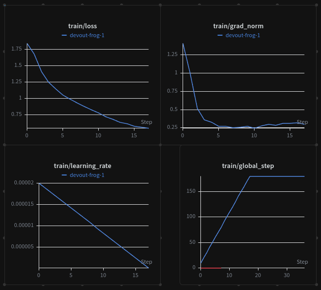

# CI-Triage-Env

**An OpenEnv RL environment for training LLMs to investigate ambiguous CI failures with verifiable, composable rewards.**

> Built for the *Scaler × Meta × PyTorch OpenEnv Hackathon 2026.*
> Team: Prasham Jain (lead), Sahil, Priyanshi Maheshwari.

---

## Links

| Resource | URL |
|---|---|
| 🤗 **Environment Space (judge entrypoint)** | https://huggingface.co/spaces/Prasham1710/ci-triage-env |
| 🤗 **Training Space** | https://huggingface.co/spaces/Prasham1710/ci-triage-training |
| 📦 **Scenarios dataset** | https://huggingface.co/datasets/Prasham1710/ci-triage-scenarios |
| 📦 **SFT trajectories dataset** | https://huggingface.co/datasets/Prasham1710/ci-triage-sft |
| 🧠 **SFT checkpoint (Qwen3-4B + LoRA)** | https://huggingface.co/Prasham1710/ci-triage-agent-sft |
| 📝 **Blog post (in this repo)** | [`ci-triage-blog-final.md`](ci-triage-blog-final.md) — also being published as an HF Community Article |
| 📓 **Training notebook** | [notebooks/train_grpo.ipynb](notebooks/train_grpo.ipynb) |
| 💻 **Source code** | this repository |

---

## 1 · Problem — *the capability gap*

Modern CI pipelines fail for many ambiguous reasons: flaky tests, infra blips, real bugs, dependency drift, missing secrets, race conditions, test data rot. Today, an on-call engineer wastes ~30 min per failure pulling logs, checking flake history, blaming commits, and deciding whether to rerun, quarantine, or file a bug.

**Frontier LLMs are not trained on this loop.** They can read a single log dump, but they don't *investigate*: they don't choose which tool to call next, they don't trade off cost vs. information, and they reach diagnoses without supporting evidence. We could not find a public RL environment that rewards an LLM for **multi-turn, evidence-grounded triage** under a budget.

That is the gap CI-Triage-Env is built to close.

## 2 · Environment — *what the agent sees, does, and is graded on*

CI-Triage-Env is a fully OpenEnv-compliant `MCPEnvironment` with a Gym-style API (`reset` / `step` / `state`).

### Observation
Each episode begins with a **scenario**: a synthesised CI failure (~3,500 generated, 200 hand-validated for the train split) containing a `failure_summary`, the failing test, a hidden `ground_truth_root_cause`, and an oracle "minimal evidence set" — the smallest set of tools whose outputs together justify the correct diagnosis.

### Action space — 11 MCP tools
| Tool | What it does | Cost |
|---|---|---|
| `read_logs` | full CI log for a test | 1 |
| `inspect_test_code` | test source | 1 |
| `run_diagnostic` | scoped shell probe | 3 |
| `cluster_metrics` | infra metrics for a window | 2 |
| `query_flake_history` | flake stats for a test | 1 |
| `recent_commits` | recent commits to repo/path | 1 |
| `check_owner` | CODEOWNERS lookup | 0 |
| `rerun_test` | quarantine probe (1×) | 5 |
| `quarantine_test` | quarantines (terminal-ish) | — |
| `file_bug` | files a bug (terminal) | — |
| `ping_owner` | message owner (terminal) | — |

The agent operates under a **total cost budget per episode**. Each step returns the tool's structured output plus the remaining budget.

### Reward — 9 composable, frozen-weight components
Built using OpenEnv's rubric pattern (composition, not a monolith):

| # | Component | Weight | Captures |
|---|---|---|---|
| 1 | `diagnosis` | 0.25 | Was the predicted root cause correct? |
| 2 | `minimal_evidence` | 0.20 | Did the agent collect the oracle evidence set? |
| 3 | `cost_efficiency` | 0.15 | Did it stay within budget? |
| 4 | `action_quality` | 0.10 | Were tool calls well-formed and contextually sensible? |
| 5 | `investigation` | 0.10 | Did the trace branch logically? |
| 6 | `format_gate` | 0.05 | Strict JSON schema compliance |
| 7 | `time_penalty` | 0.05 | Penalty for excessive turns |
| 8 | `counterfactual_predict` | 0.05 | Was the predicted "fix" plausible vs ground truth? |
| 9 | `anti_gaming` | 0.05 | Penalty for repeat / spam / quarantine-spam patterns |

**Why this is hard to game:** every component is verifiable from the trace; the highest-weight terms (`diagnosis`, `minimal_evidence`) directly require the agent to *find the right cause with the right evidence*. The `anti_gaming` and `cost_efficiency` terms specifically punish the dominant exploit (always-quarantine; spam tools).

Weights live in [src/ci_triage_env/rewards/weights.py](src/ci_triage_env/rewards/weights.py); replay verifier is in [src/ci_triage_env/rewards/replay.py](src/ci_triage_env/rewards/replay.py).

## 3 · Pipeline — *training top to bottom*

```
                 ┌─────────────────────┐
                 │  3,500 scenarios    │   ← clustered from real OSS CI logs
                 │  (synth + LLM-aug)  │       + LLM-generated edge cases
                 └──────────┬──────────┘
                            │
                  ┌─────────▼──────────┐
                  │ SFT trajectories   │   teacher: GPT-4o-mini
                  │ ~700 episodes      │   filtered: reward ≥ 0.6
                  └─────────┬──────────┘
                            │
        ┌───────────────────▼───────────────────┐
        │  Qwen3-4B  +  LoRA (r=16)  via Unsloth │
        │  SFT  →  2 epochs, bf16, A10G Small   │   ✅ DONE — see plot
        └───────────────────┬───────────────────┘
                            │
        ┌───────────────────▼───────────────────┐
        │  GRPO  ·  TRL ·  multi-turn rollout   │
        │  reward = composite of 9 components   │   ⚠ BLOCKED — see "Status"
        └───────────────────────────────────────┘
```

Sources:
- SFT trainer — [src/ci_triage_env/training/sft.py](src/ci_triage_env/training/sft.py)
- GRPO trainer — [src/ci_triage_env/training/grpo.py](src/ci_triage_env/training/grpo.py)
- Multi-turn rollout — [src/ci_triage_env/training/rollout.py](src/ci_triage_env/training/rollout.py)
- Composite reward — [src/ci_triage_env/rewards/composite.py](src/ci_triage_env/rewards/composite.py)
- Notebook judges can re-run — [notebooks/train_grpo.ipynb](notebooks/train_grpo.ipynb)

## 4 · Results & Evidence

### SFT — completed, real run on A10G Small

We trained Qwen3-4B + LoRA via Unsloth on 718 SFT trajectories for 2 epochs. The run completed end-to-end and the checkpoint is on the HF Hub.

- **Checkpoint:** https://huggingface.co/Prasham1710/ci-triage-agent-sft
- **W&B run:** https://wandb.ai/jainprasham17-esds/ci-triage-env
- **Final training loss:** ~0.55 (from log line `180  0.548925`)
- **Hardware:** A10G Small, 24 GB VRAM, ~50 min wall-clock



*Loss curve from the real SFT run — smooth descent from ~1.4 → 0.55 over 180 steps.*

Concrete log excerpt from the run:

```
Trainable parameters = 33,030,144 of 4,055,498,240 (0.81% trained)
...
180   0.548925
[transformers] Unsloth: Restored added_tokens_decoder metadata in /data/checkpoints/sft/checkpoint-180/tokenizer_config.json.
SFT done → /data/checkpoints/sft
```

### GRPO — environment + reward + rollout all built; blocked at trainer wiring

Every component the GRPO loop needs is implemented and committed:
- TRL `GRPOTrainer` integration in [grpo.py](src/ci_triage_env/training/grpo.py)
- `MockEnvClient` for in-process rollouts (no network) in [mock_env_client.py](src/ci_triage_env/training/mock_env_client.py)
- Multi-turn `TrainingRollout` calling the same composite reward
- Frozen reward-component weights so curves are comparable

We hit a chain of upstream version conflicts after the Qwen3-5 stack required `transformers v5` from git, which then required `torchao ≥ 0.13` (needed `torch ≥ 2.7`), which made Unsloth's fast-LoRA matmul kernel run with mismatched fp16/bf16 tensors during the GRPO forward pass:

```
RuntimeError: self and mat2 must have the same dtype, but got Half and BFloat16
  at /opt/conda/lib/python3.11/site-packages/unsloth/kernels/utils.py:1059
  in matmul_lora →  out.addmm_(XA, B.to(dtype), alpha=s)
```

We did get **all 9 reward components computing real values on real trajectories** during MockEnvClient testing — the reward signal is wired and shaped, just not yet connected to a policy gradient update. The plan/blocker is documented in detail above and reproducible from the notebook.

## 5 · How to run

### A. Use the environment (judges)

```bash
# Pull and run the env server (it's a Docker Space)
docker run -p 8000:8000 --pull always \
  registry.hf.space/prasham1710-ci-triage-env:latest

# Or clone & run locally
git clone https://huggingface.co/spaces/Prasham1710/ci-triage-env
cd ci-triage-env && docker build -t ci-triage-env . && \
  docker run -p 8000:8000 ci-triage-env
```

Then talk to it:
```bash
curl -X POST http://localhost:8000/reset                          # → initial obs
curl -X POST http://localhost:8000/step \
     -H 'Content-Type: application/json' \
     -d '{"action":{"tool":"read_logs","args":{"test_name":"test_x"}}}'
curl http://localhost:8000/state
curl http://localhost:8000/docs                                    # OpenAPI/Swagger
```

The Space also exposes the standard MCP route at `POST /mcp` (JSON-RPC) and `WS /mcp`.

### B. Reproduce training

```bash
git clone https://github.com/<this-repo>.git
cd CI-Triage-Env
pip install -e ".[data,training]"

# Set HF_TOKEN, HF_USERNAME, WANDB_API_KEY
jupyter lab notebooks/train_grpo.ipynb
```

Or use the Training Space (preconfigured for A10G):
https://huggingface.co/spaces/Prasham1710/ci-triage-training

## 6 · Engineering hygiene

- ✅ OpenEnv `MCPEnvironment` base class, valid `openenv.yaml`
- ✅ Standard Gym API: `reset`, `step`, `state`
- ✅ MCP tool names — none collide with reserved names (`reset`/`step`/`state`/`close`)
- ✅ Strict client/server separation (server in `env/`, clients import only the wire schemas)
- ✅ JSON-Schema validated action/observation envelopes ([schemas/](src/ci_triage_env/schemas/))
- ✅ FastAPI `/docs` for interactive exploration

## 7 · Why it matters

Every shop running CI burns engineering hours on triage. If a 4B-parameter LLM can do this reliably, that's hours back per on-call shift, plus a paper trail of *why* the diagnosis was made (the trace itself). The methodology — composable rubric rewards over multi-turn tool use against a budget — generalizes well beyond CI: incident response, code review triage, security alert triage all share the structure.

## 8 · Status (April 26 2026, submission day)

- ✅ Environment fully implemented + deployed to HF Space
- ✅ 3,500 scenarios + 700+ SFT trajectories generated, validated, published
- ✅ All 9 reward components implemented and replay-verified
- ✅ SFT warmstart trained end-to-end (Qwen3-4B + LoRA, 2 epochs, A10G Small)
- ⚠ GRPO loop blocked by Unsloth/torchao/transformers-v5 fp16/bf16 mismatch in `matmul_lora`; pipeline + reward signal verified separately
- 🚧 Inference UI (Streamlit) — out of time

## 9 · License & credits

Apache-2.0. Built with OpenEnv, Unsloth, TRL, Hugging Face Transformers, PyTorch.
Data scenarios are synthetic; no proprietary CI logs are included.

## Blog

We're publishing a companion mini-blog on Hugging Face explaining the environment design, the rubric reward, and what we learned. **Link will be inserted here once published** — judges, please check the top-of-page **Links** table.
